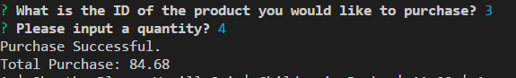
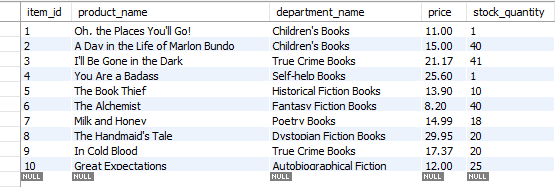
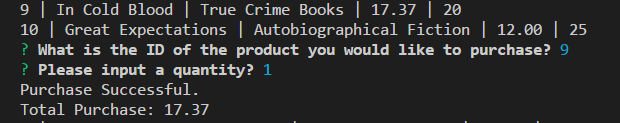
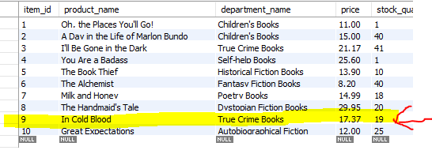

## bamazon

MYSQL Homework

### Step 1

Created a database using MySQL workbench which contained a table with 10 books in my "amazon book store". 

### Step 2

In the terminal you can see that I list my table from my database and prompt the user with 2 questions.
The database will be updated only if my "store" has what the user wants in stock. 
The total of their purchase also displays if the purchase is successful.

### Examples
If purchase is not successful due to lack in stock:

If purchase is successful in VSC and MySQL:

